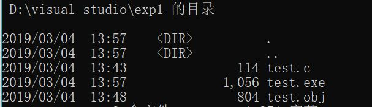
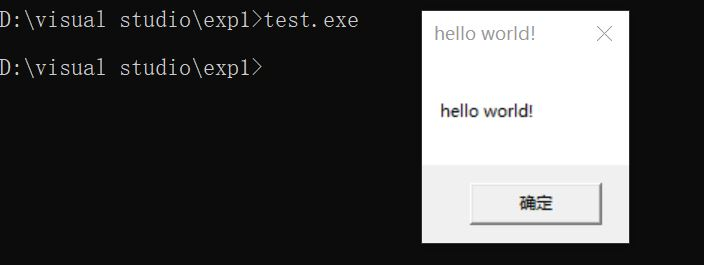
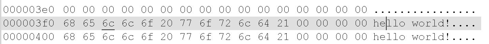
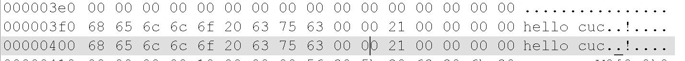
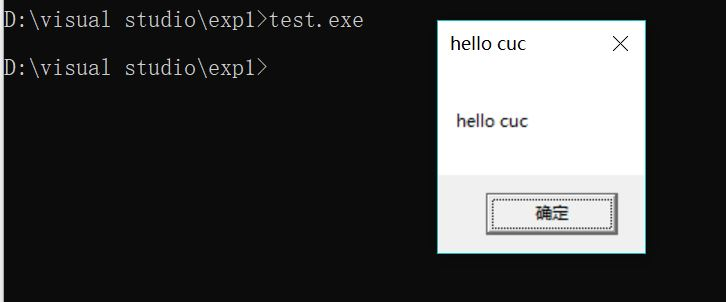

### 实验1

**要求：编写一个release版本的 hello world 程序。通过修改程序可执行文件的方式（不是修改源代码），使得程序运行后显示的内容不为hello world，变成 hello cuc！**

```hello world```程序源码为：
```txt
#include <windows.h>
int main()
{
	MessageBoxA(NULL,"hello world!","hello world!",NULL);
	ExitProcess(0);
}
```

在命令行中进行编译：
```txt
cl /nologo /c test.c
```

得到```test.obj```

再进行链接：
```txt
link /nologo /ENTRY:main /NODEFAULTLIB /SUBSYSTEM:WINDOWS /ALIGN:16 test.obj user32.lib kernel32.lib
```

得到可执行程序```test.exe```

查看一下文件大小：



运行结果如下：



利用安装了```HexEditor```插件的```Notepad++```打开可执行程序的二进制文件，找到了```hello world!```



将```hello world!```改为```hello cuc!```，并将字符结尾改为```00```



重新执行```test.exe```，运行结果如下：

