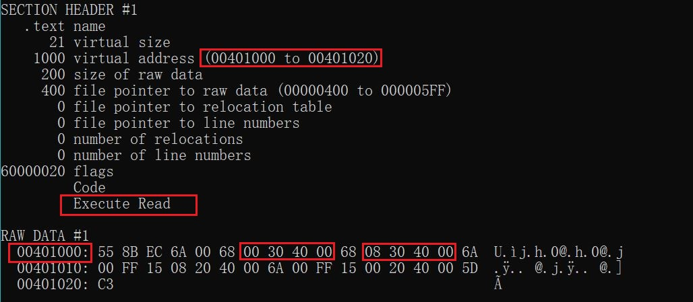
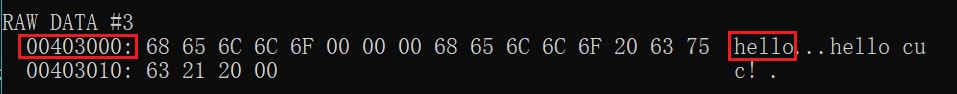
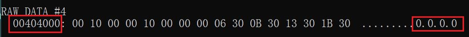
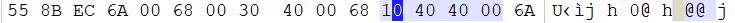
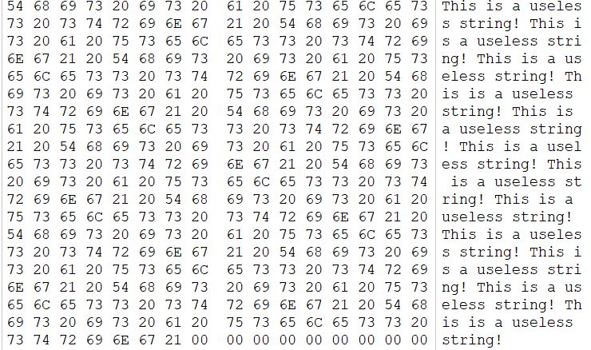
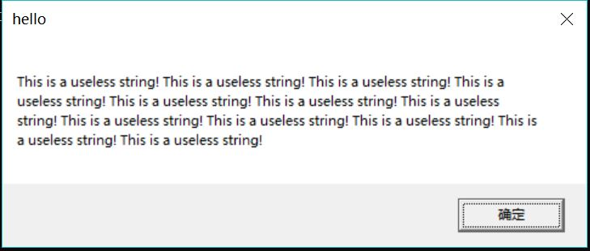

### 实验2

实验源码同实验1。

在命令行中进行编译：
```txt
cl /nologo /c 2.c
```

得到```2.obj```

再进行链接：
```txt
link /nologo /ENTRY:main /NODEFAULTLIB 2.obj user32.lib kernel32.lib
```

得到可执行程序```2.exe```

在命令行中```dumpbin /all 2.exe```



可以看到代码段起始地址为：```00401000```

观察代码段，可以发现有两个地址为```00403000```和```00403008```，而
```00403000```表示的内容为```hello```，是MessageBox的标题，而我们要更改的是```00403008```起始处的```hello cuc!```



在文件末增加字符串，需要先找到可增加字符串的起始地址。由下图可以看出，文件末地址为```00404000```，则字符串起始地址为```00404010```



在```WinHex```中打开可执行程序，将```00401000```处的```00403008```更改为```00404010```



增加的字符串为：



执行更改的可执行程序，结果为：


