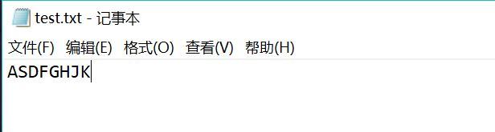
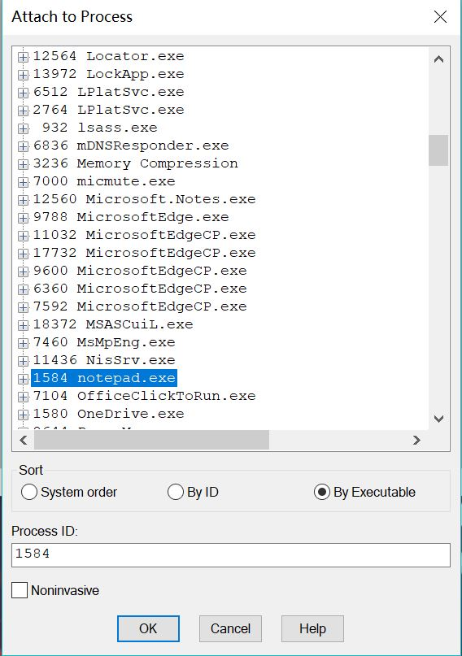
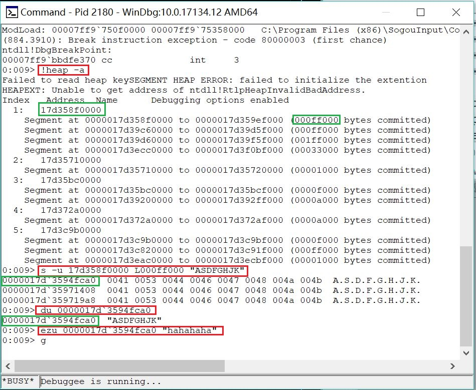

### 实验3

**要求：在notepad（32位64位均可）中，输入一段文字。然后使用调试器，在内存中修改这段文字。使得没有在界面操作notepad的修改文字的情况下。notepad中显示的文字变化。**

在notepad中输入以下字符串并保存：



使用```windbg```附加到```notepad.exe```上：



先查看所有堆：```!heap -a```

在指定内存中查找字符串：```s -u 17d358f0000 L000ff000 "ASDFGHJK"```

显示Unicode字符：```du 0000017d`3594fca0```

修改字符串：```ezu 0000017d`3594fca0 "hahahaha"```

继续执行程序：```g```



修改后的结果显示：


