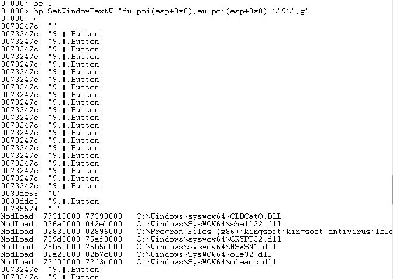

### 实验4

**要求：通过调试器监控计算器程序的运行，每当运行结果为666时，就改为999。**

实验环境：

仅在win7(32bit)+windbg(32bit)环境下，win10系统不支持

实验过程：

由于```calc.exe```在```C:\Windows\SysWOW64```中，先进入该文件夹，并对```calc.exe```进行```dumpbin```操作查看导入表，并将结果保存在```calc_imp.txt```中。


在```calc_imp.txt```中，发现系统通过调用 ```SetWindowTextW``` API将计算器按键与结果显示在屏幕上。


在```windbg```中，首先配置```Symbol File Path```


执行```.reload /f /i```，载入符号表

在```SetWindowTextW```处下断点，使用```dd```命令查看当前地址，由于原函数有两个参数，而```esp+0x8```地址的指针指向显示在屏幕上的内容


重新在```SetWindowTextW```处下断点，执行```bp SetWindowTextW "du poi(esp+0x8);eu poi(esp+0x8) \"9\";g"```




弹出的计算器变更为：

