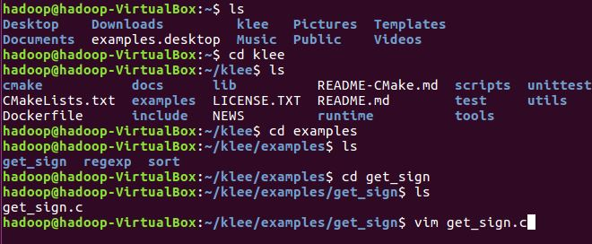
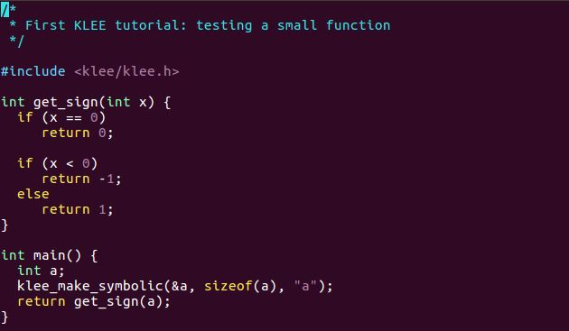
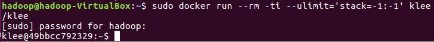
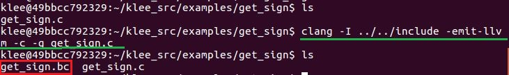
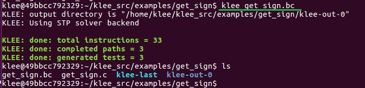
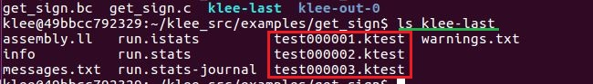
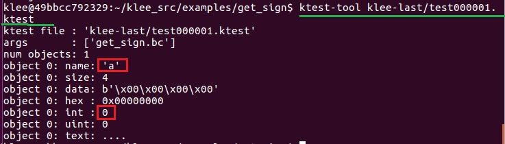
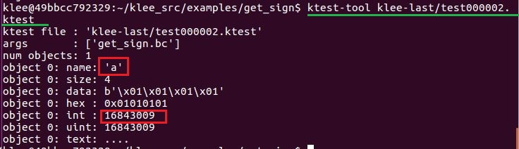
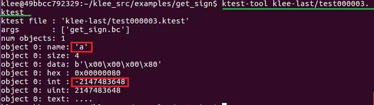

# 使用KLEE生成测试用例
## 实验环境
Ubuntu 16.04 LTS 64位操作系统

## 安装Docker
```bash
# 更新源
sudo apt update
# 安装python3
sudo apt install python3 python3-pip
# 不再保留原有的python2.7.x环境
sudo update-alternatives --install /usr/local/bin/python python /usr/bin/python3 100
sudo update-alternatives --install /usr/local/bin/pip pip /usr/bin/pip3 100
# 经过上述两条指令，系统默认执行python和pip
# 将python3-pip相关的可执行程序所在目录设置到当前用户PATH环境变量的最高优先级
grep -q 'PATH=${HOME}/local/.bin:$PATH' ~/.bashrc || echo 'PATH=${HOME}/local/.bin:$PATH' >> ~/.bashrc
tail ~/.bashrc
# 使得上述环境变量变更生效
source "${HOME}/.bashrc"

pip install -U pip
sudo vi /usr/local/bin/pip
# 修改为
from pip._internal import main
# 开始准备安装Docker-CE
sudo apt-get install -y \
apt-transport-https \
ca-certificates \
curl \
software-properties-common

apt policy docker-ce
apt policy docker.io
curl -fsSL https://download.docker.com/linux/ubuntu/gpg | sudo apt-key add -
# 添加软件源
echo "deb https://apt.dockerproject.org/repo ubuntu-xenial main" | sudo tee /etc/apt/sources.list.d/docker.list
# 更新软件包缓存
sudo apt-get update
# 安装Docker-CE
sudo apt install docker-ce
# 修改配置文件
sudo vi /etc/docker/daemon.json
# 增加
{
    "registry-mirrors": ["https://docker.mirrors.ustc.edu.cn/"]
}
# 重启docker
sudo systemctl restart docker
```

## 安装KLEE
```bash
# 从github上获取klee源码
git clone https://github.com/klee/klee.git
cd klee
# 使用存储库根目录中dockerfile的内容来构建docker映像
sudo docker build -t klee/klee .
# 创建docker映像
sudo docker run -ti --name=my_first_klee_container --ulimit='stack=-1:-1' klee/klee
# 退出docker
exit
# 再次启动输入
sudo docker start -ai my_first_klee_container
```

## 选取目标函数
选取Tutorial中的示例函数get_sign()如下：
```txt
int get_sign(int x) {
  if (x == 0)
    return 0;

  if (x < 0)
    return -1;
  else
    return 1;
}
```

## 将输入标记为符号
为了使用KLEE对函数进行测试，需要将目标函数装入完整的代码程序中，get_sign.c如下：
```txt
int get_sign(int x) {
  if (x == 0)
    return 0;

  if (x < 0)
    return -1;
  else
    return 1;
}
int main() {
  int a;
  klee_make_symbolic(&a, sizeof(a), "a");
  return get_sign(a);
}
```





为了将变量标记为符号，使用klee_make_symbolic()函数将某一个变量符号化。该函数需要三个参数：符号变量地址，符号变量占用内存字节，和它所采用的符号名称。

## 编译成LLVM中间语言
现在运行KLEE镜像
```bash
sudo docker run --rm -ti --ulimit='stack=-1:-1' klee/klee
```


KLEE在LLVM bitcode上运行。要使用KLEE运行程序，首先要使用它将其编译为LLVM bitcode。

首先安装clang：
```bash
# 更新源
sudo apt-get update
# 安装clang
sudo apt install clang
```

```bash
# -I：为了让编译器可以找到<klee/klee.h>头文件
# -g：为了增到调试信息到bitcode文件中
clang -I ../../include -emit-llvm -c -g get_sign.c
```
将源码get_sign.c编译成LLVM中间语言，得到get_sign.bc文件



## KLEE进行符号执行
用KLEE对编译后得到的中间语言进行符号执行
```bash
klee get_sign.bc
```
get_sign()函数有三条路径。程序分别在以下情况下执行：
- a=0
- a>0
- a<0

KLEE将对所有三条路径进行探索，并且为每一条路径生成一个包含具体值而非符号值的测试用例。

KLEE符号执行的输出信息如下：



## 查看生成的测试用例信息
针对不同或相同的LLVM中间字节码，每当klee命令执行一次，就会在当前目录下生成一个klee执行后的信息统计文件，并有一个快捷方式klee-last，指向最新一次因klee执行而生成的目录klee-out-X

在klee-last目录下的文件如图：



目录下的以```.ktest```为后缀名的文件中，包含有klee产生的测试用例。如图所示，在对get_sign()函数进行符号执行以后，产生了三个测试用例，分别位于：
- test000001.ktest
- test000002.ktest
- test000003.ktest

执行以下命令：
```bash
ktest-tool klee-last/test000001.ktest
ktest-tool klee-last/test000002.ktest
ktest-tool klee-last/test000003.ktest
```

显示.ktest文件如图所示：

该测试用例是由执行```x=0```时的路径得来



该测试用例是由执行```x>0```时的路径得来



该测试用例是由执行```x<0```时的路径得来



.ktest文件指出：
- klee调用.o文件执行时所传递的参数
- 当前生成的测试用例所对应的路径在执行时被符号化的对象的个数
- 被符号化对象的名字
- 被符号化对象的字节大小
- 在当前测试用例中的具体值

**综上可知，对于get_sign()函数，在此次符号执行产生的三个测试用例中，被符号化对象为a，其值分别为0，16843009，-2147483648，对应于执行x=0，x>0，x<0时所对应的三条路径。**

## 实验结果
在Docker中运行KLEE镜像，使用KLEE对一个目标函数进行符号执行，覆盖全部路径，并生成了相应的测试用例。

## 参考链接
[Tutorial One](https://klee.github.io/tutorials/testing-function/)